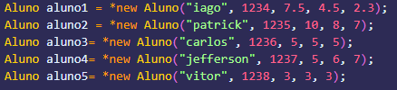
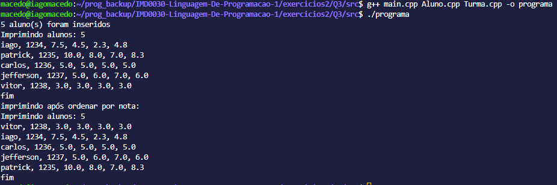

ENTRADA
        São criados dinamicamente 5 objetos de alunos, com diferentes atributos para cada um. Esses 5 alunos
    são inseridos em um array de objetos Aluno. Esse array é passado como atributo para o objeto Turma, também criado na main.
        Uma vez estando no objeto Turma, podemos chamar o método imprimeAlunos.
        
        
SAÍDA
O método imprimeAlunos percorre todos os alunos existentes no atributo alunos do objeto Turma. No caso descrito, os alunos passados pelo método setAlunos são imprimidos corretamente como esperado.
        